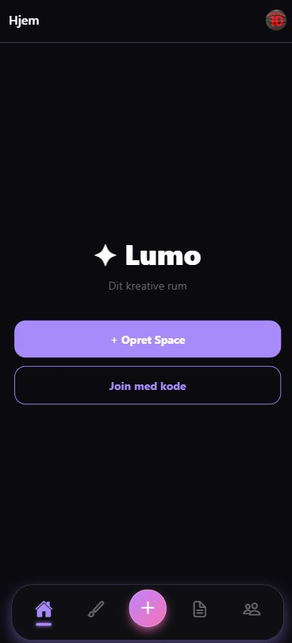
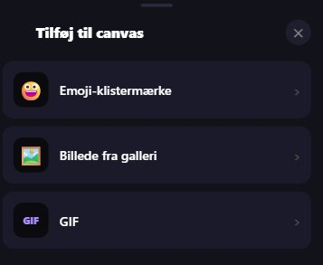
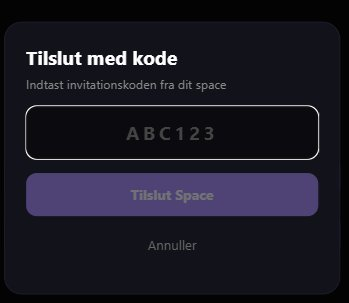
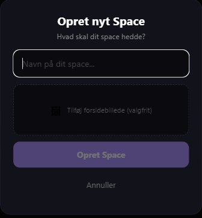
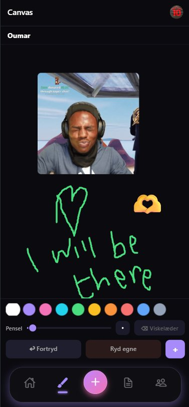
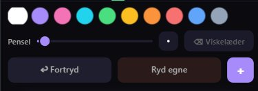
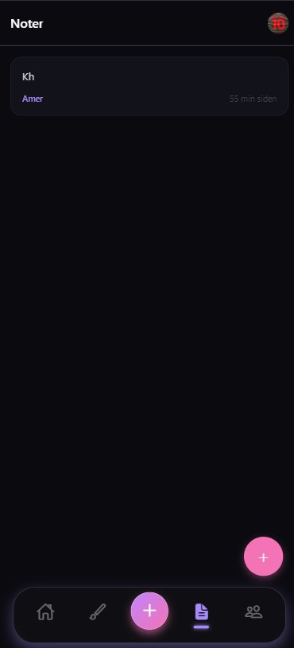
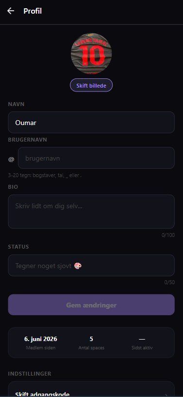

# ✦ Lumo

> **Det hurtigste sted at dele tanker visuelt med mennesker, der betyder noget.**

Lumo er en privat, kreativ samarbejdsapp til folk der vil mere end bare tekst. Tegn, skriv noter og del idéer i realtid med dem du holder af — uden social media-støj.

---

## 📱 Screenshots

<table>
  <tr>
    <td align="center"><strong>Hjem</strong></td>
    <td align="center"><strong>Opret Space</strong></td>
    <td align="center"><strong>Join med kode</strong></td>
    <td align="center"><strong>Canvas</strong></td>
  </tr>
  <tr>
    <td></td>
    <td></td>
    <td></td>
    <td></td>
  </tr>
  <tr>
    <td align="center"><strong>Canvas Toolbar</strong></td>
    <td align="center"><strong>Stickers & GIF</strong></td>
    <td align="center"><strong>Noter</strong></td>
    <td align="center"><strong>Profil</strong></td>
  </tr>
  <tr>
    <td></td>
    <td></td>
    <td></td>
    <td></td>
  </tr>
</table>

---

## ✨ Features

### 🏠 Shared Spaces
Opret private rum til dig og dine nærmeste. Invite-only via en unik kode — ingen offentlige profiler, ingen algoritmer.

- Opret et space med navn og valgfrit coverbillede
- Del invitationskoden med dem du vil have med
- Se hvem der er online med grøn prik

### 🎨 Fælles Canvas
Et delt whiteboard hvor alle kan tegne samtidig — opdateret i realtid via Firebase.

- Tegn frit med fingeren
- Vælg mellem 10+ farver
- Juster penselstørrelse med en slider
- Viskelæder til at slette egne streger
- Fortryd og ryd egne tegninger
- Tilføj **emoji-klistermærker**, **billeder fra galleri** og **GIFs** direkte på canvas
- Live cursor — se præcis hvor andre tegner

### 📝 Fælles Noter
Del tanker, lister og idéer som noter i dit space — synkroniseret i realtid.

- Opret, rediger og slet noter
- Se forfatter og relativ tid ("5 min siden")
- Realtime opdatering via Firebase — ingen manuel refresh

### 👤 Profil
Tilpas din profil og håndter dine indstillinger.

- Profilbillede, navn, brugernavn og bio
- Status — "Tegner noget sjovt 🎨"
- Statistik: Antal spaces, Medlem siden, Sidst aktiv
- Skift adgangskode, notifikationer, log ud, slet konto

### 🔔 Presence
Se hvem der er online i dine spaces med et grønt dot ved siden af deres navn.

---

## 🛠 Tech Stack

| Lag | Teknologi |
|-----|-----------|
| Frontend | React Native (Expo SDK 54) |
| Tegning | PanResponder + SVG paths |
| Realtime | Firebase Realtime Database |
| Auth | Firebase Authentication |
| Backend | Node.js serverless (Vercel) |
| Database | Turso (libSQL / SQLite edge) |
| Storage | Base64 i Turso |
| Navigation | React Navigation + Glassmorphism Tab Bar |

---

## 🏗 Arkitektur

```
lumo3/ (Frontend)
├── App.js                    ← Entry point
├── config/
│   └── firebase.js           ← Firebase init
├── models/                   ← Data models
├── services/                 ← API & Firebase services
│   ├── AuthService.js
│   ├── SpaceService.js
│   ├── CanvasService.js
│   ├── LiveCanvasService.js  ← Firebase realtime
│   ├── LiveNotesService.js   ← Firebase realtime
│   ├── NoteService.js
│   ├── PresenceService.js
│   └── GifService.js         ← Giphy integration
├── controllers/              ← Business logic hooks
├── context/                  ← Auth & Space context
├── views/                    ← Screen components
│   ├── auth/AuthScreen.js
│   ├── HomeView.js
│   ├── CanvasView.js
│   ├── DrawingCanvas.js
│   ├── StickerSheet.js
│   ├── NotesView.js
│   ├── SpacesView.js
│   └── ProfileView.js
└── navigation/
    ├── AppNavigator.js
    ├── RootNavigator.js
    └── GlassTabBar.js        ← Glassmorphism navbar

lumo-backend/ (Backend)
├── api/
│   ├── users/index.js
│   ├── spaces/index.js
│   ├── spaces/join.js
│   ├── canvases/index.js
│   ├── notes/index.js
│   ├── presence/index.js
│   └── widgets/index.js
├── lib/
│   ├── turso.js
│   ├── auth.js
│   └── cors.js
└── schema.sql
```

---

## 🗄 Database Schema

```sql
users         — id, display_name, username, bio, status, avatar_url, firebase_uid
spaces        — id, name, owner_id, invite_code, cover_image
space_members — space_id, user_id, role
canvases      — id, space_id, snapshot_url, created_by, updated_at
notes         — id, space_id, author_id, content, created_at, updated_at
widgets       — id, space_id, user_id, last_snapshot_url
presence      — user_id, space_id, last_seen
```

---

## 🚀 Kom i gang

### Backend

```bash
cd lumo-backend
npm install
```

Opret `.env` fra `.env.example` og udfyld:

```
TURSO_URL=libsql://din-database.turso.io
TURSO_AUTH_TOKEN=dit_token
FIREBASE_PROJECT_ID=dit_projekt
FIREBASE_CLIENT_EMAIL=din_email
FIREBASE_PRIVATE_KEY=din_nøgle
```

Deploy til Vercel:

```bash
vercel --prod
```

### Frontend

```bash
cd lumo3
npm install
npx expo start
```

Scan QR-koden med Expo Go på din telefon.

---

## 🔮 Roadmap

- [ ] Push notifikationer
- [ ] Home screen widget
- [ ] Aktivitetsfeed
- [ ] Space cover billeder
- [ ] iOS App Store release
- [ ] Android APK via EAS Build
- [ ] AI-lag (forbedr tegninger, opsummer noter)

---

## 👨‍💻 Udviklet af

**Oumar Ammar** — Software Engineer (Diplomingeniør, VIA University College 2026)

- GitHub: [@oumar969](https://github.com/oumar969)
- Portfolio: [oumar969.github.io](https://oumar969.github.io)

---

*Lumo — Dit kreative rum* ✦
